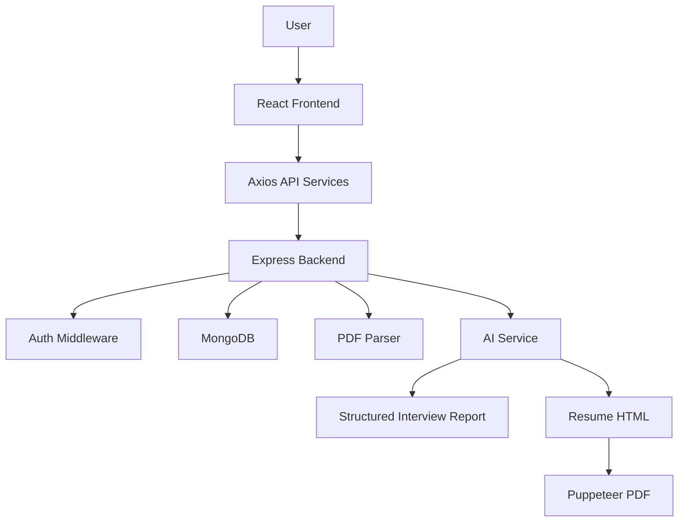

# GenAI Job Preparation App

> A full-stack AI-powered job preparation platform for resume analysis, interview report generation, profile management, and tailored career preparation.


## Overview

GenAI Job Preparation App is a full-stack MERN-style application that helps users prepare for job applications and interviews. Users can register, log in, upload resumes, provide role context, generate AI-powered interview preparation reports, and create tailored resume PDFs.

This project demonstrates authentication, protected routes, file upload handling, MongoDB persistence, AI service integration, PDF parsing, PDF generation, and a feature-based frontend structure.

## Features

| Feature | Description |
| --- | --- |
| Authentication | Register, login, logout, and protected user sessions with JWT cookies. |
| Profile Management | Create, view, and update user profile information. |
| Resume Upload | Upload resume PDFs using memory-based Multer handling. |
| AI Interview Report | Generate structured interview preparation reports from resume and job context. |
| Resume PDF Generation | Generate tailored resume PDFs from AI-produced HTML. |
| Report History | Store and retrieve interview reports by authenticated user. |
| Protected Frontend Routes | Restricts app pages to authenticated users. |
| MongoDB Persistence | Stores users, reports, and blacklisted logout tokens. |

## Tech Stack

| Layer | Technology |
| --- | --- |
| Frontend | React, Vite, Sass, Axios, React Router |
| Backend | Node.js, Express.js |
| Database | MongoDB, Mongoose |
| Authentication | JWT, bcryptjs, cookie-parser |
| AI | Google GenAI SDK, Zod schemas |
| File Handling | Multer, pdf-parse |
| PDF Generation | Puppeteer |

## Architecture



## Folder Structure

```text
Gen-AI-Job-Preparation-App/
├── Backend/
│   ├── server.js
│   ├── src/
│   │   ├── app.js
│   │   ├── config/
│   │   ├── controllers/
│   │   ├── middlewares/
│   │   ├── models/
│   │   ├── routes/
│   │   └── services/
│   └── package.json
└── Frontend/
    ├── src/
    │   ├── features/
    │   │   ├── auth/
    │   │   ├── interview/
    │   │   ├── layout/
    │   │   └── profile/
    │   ├── app.routes.jsx
    │   └── main.jsx
    └── package.json
```

## Environment Variables

Create `Backend/.env`:

```env
MONGO_URI=your-mongodb-connection-string
JWT_SECRET=your-secure-jwt-secret
GEMINI_API_KEY=your-google-genai-api-key
```

Never commit real secrets.

## Installation

Backend:

```bash
cd Backend
npm install
npm run dev
```

Frontend:

```bash
cd Frontend
npm install
npm run dev
```

Default local URLs:

```text
Frontend: http://localhost:5173
Backend:  http://localhost:3000
```

## API Overview

| Method | Endpoint | Purpose |
| --- | --- | --- |
| `POST` | `/api/auth/register` | Create a user account. |
| `POST` | `/api/auth/login` | Authenticate a user. |
| `POST` | `/api/auth/logout` | Logout and blacklist token. |
| `GET` | `/api/auth/me` | Return current authenticated user. |
| `POST` | `/api/interview` | Upload resume and generate interview report. |
| `GET` | `/api/interview` | List saved interview reports. |
| `GET` | `/api/interview/:InterviewId` | Get one report. |
| `GET` | `/api/interview/:interviewReportId/resume` | Generate tailored resume PDF. |
| `GET/POST/PUT` | `/api/profile` | Manage user profile. |

## Security Review Notes

Current strengths:

- Passwords are hashed with bcrypt.
- JWT authentication is implemented.
- Logout blacklists tokens.
- File upload size is limited.

Recommended production hardening:

- Set cookie flags: `httpOnly`, `secure`, `sameSite`.
- Add request validation to every controller with Zod.
- Add rate limiting to auth and AI endpoints.
- Add CORS origin configuration through environment variables.
- Validate uploaded file MIME type, not only file size.
- Remove demo/temp data files from production code.
- Add centralized error handling middleware.

## Testing

Recommended next steps:

- Backend route tests with Jest/Supertest.
- Auth middleware tests.
- AI service tests with mocked provider responses.
- Frontend component tests for auth, upload, and report pages.
- E2E happy path for login → upload → report generation.

## Roadmap

- Add production deployment guide.
- Add automated test suite.
- Add Docker Compose for frontend, backend, and MongoDB.
- Add loading/error states across every AI workflow.
- Add report sharing/export features.
- Add admin analytics dashboard.
- Add CI pipeline for lint/build/test.

## Author

Built by [Pooja24100](https://github.com/Pooja24100).
